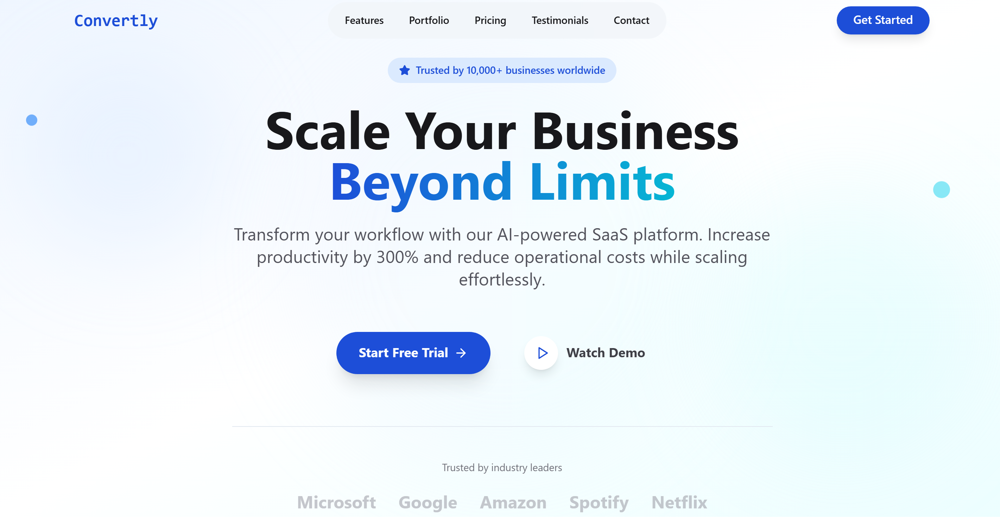

# AI-Powered SaaS Platform Landing Page

A sleek and interactive landing page for an **AI-powered SaaS platform**, built with **React**, **Tailwind CSS**, and **Framer Motion**. Designed to showcase product features, pricing, and CTAs with smooth animations and a modern aesthetic.



Live demo: (https://convertly-nu.vercel.app/)

## Features

- Fully responsive and mobile-friendly
- Animated UI using Framer Motion
- Modular and reusable React components
- Modern design built with Tailwind CSS
- Sections for hero, features, pricing, testimonials, and contact

## Stack

- **React**
- **Tailwind CSS**
- **Radix UI**
- **Framer Motion**

## Getting Started

```bash
git clone https://github.com/dev-mas-ud/convertly.git
cd convertly
npm install
npm run dev
```
